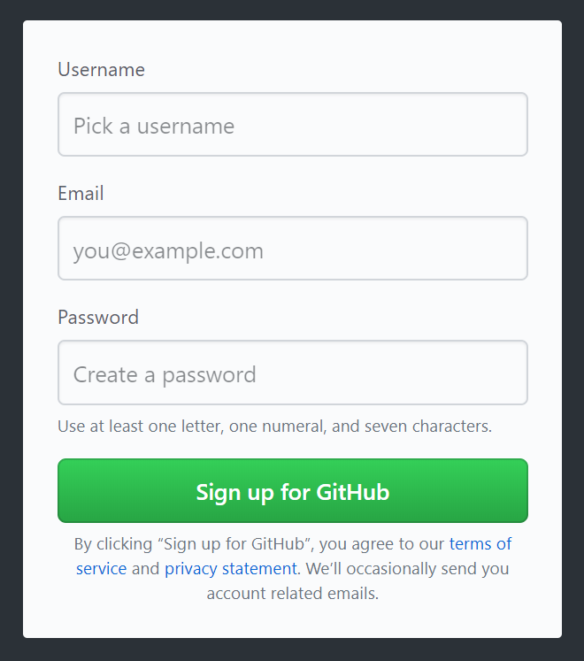
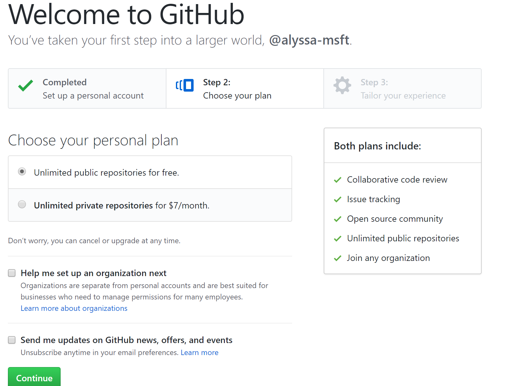
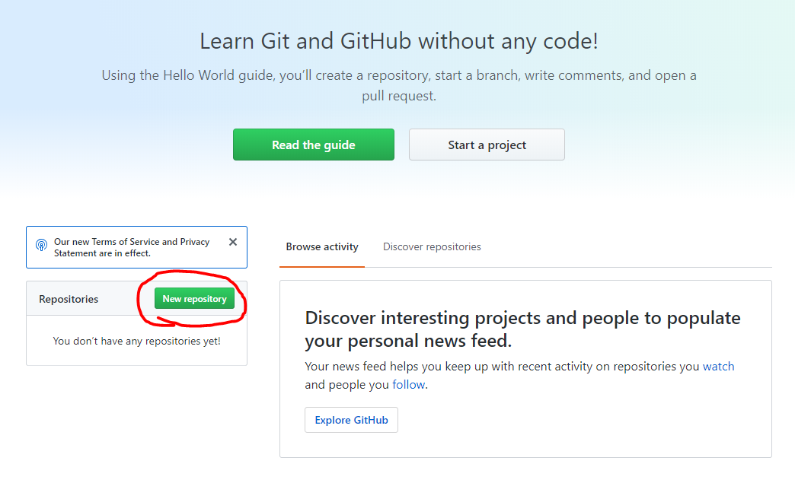
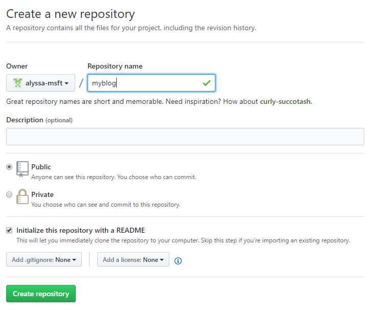
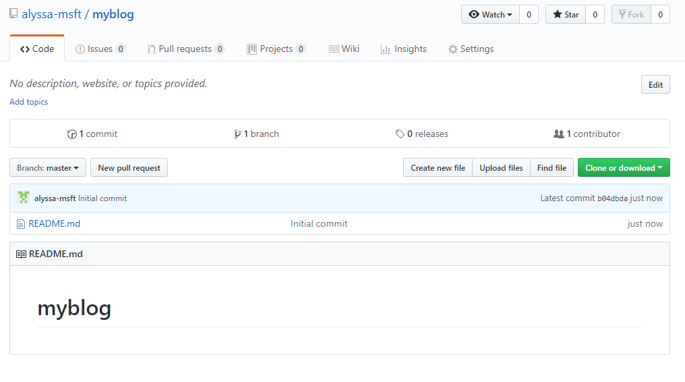

# Getting started with GitHub  

## Introduction
This lesson will take you through setting up a GitHub account and creating a GitHub repository.

## Before you start
**You will need...**
* Computer or laptop
* Wi-Fi

## Lesson Overview
* Lesson 1: Creating a GitHub Account
* Lesson 2: Making a GitHub Repository

## Lesson 1: Creating a GitHub Account

The first thing we need to do is make sure you have a GitHub account. 
* If you have a GitHub account log into:
    * https://github.com/

* If you do not have an GitHub account, the following steps below will help you create a GitHub account.
    1. Go to https://github.com
    2. Fill out the form with a username, email, and password, then click Sign up for GitHub
    
    3. Next you will need to choose the plan for your account. Pick the "Unlimited public repositories for free". Then click Continue.
    
    4. Finally take the survey to finish setting up your account. Then click Submit.
    

## Lesson 2: Making a GitHub Repository

A repository is like a folder for your project. Your project's repository contains all of your project's files and stores each file's revision history. In this lesson we will be creating a repository. This repository will be used later in this lesson when we create a blog to deploy to GitHub pages. 

The steps below will take you through how to create a repository on GitHub.

1. On the home page of GitHub click on the 'New repository' button on the left hand side of the page. 

2. You will be taken to this page seen below. Fill in the repository name, click 'Public' to make the repository public, and click 'Initialize this repository with a README'. The README is where you can put information about your project. To finish making your repository click 'Create repository' button.

3. After creating the repository you will be taken to your repository page. 

c