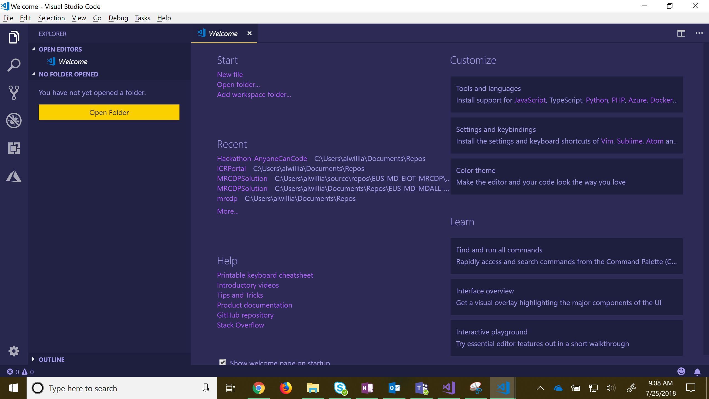

# Text Editor Lesson

## Introduction
In this lesson we will learn how to use a the text editor, Visaul Studio Code, to create and edit projects. This text editor will be used to make edits to your portfolio/blog that will be uploaded to GitHub pages. 

## Before you start
**You will need...**
* Computer/Laptop
* Wi-fi
* Visual Studio Code

**Setup**
* Download Visual Stuio Code to your computer/laptop
    * https://code.visualstudio.com/download

## Lesson Overview
* Lesson 1: Opening project in Visual Studio Code
* Lesson 2: Adding files and folders to project in Visual Studio Code

## Lesson 1: Opening project in Visual Studio Code
1. Open Visual Studio Code.
 
2. Open the Explorer tab on Visual Studio Code.
 
3. To open you project click on the 'Open Folder' button, then find the project in the explorer pop up, click on the folder you want to open, and click 'Select Folder'.

## Lesson 2: Adding files and folders to project in Visual Studio Code
1. In Visual Studio Code, make sure the explorer tab is open. If you click on the folder icon circled in red, it will create a new folder inside of the project. If you click on the paper icon circiled in yellow it will make a new file inside of the project. When you click on either of the icons you will have to give them a name. The main difference between the icons is when you make a new file you have to give it a file type (Example: ``.html, .css, .js, etc.``).
 

  